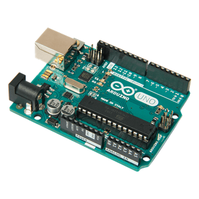
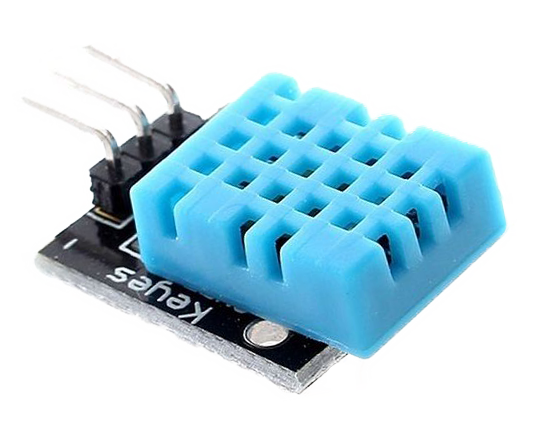
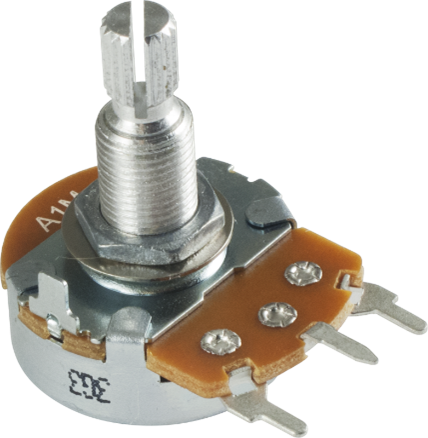
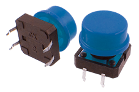
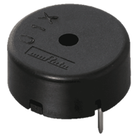
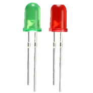
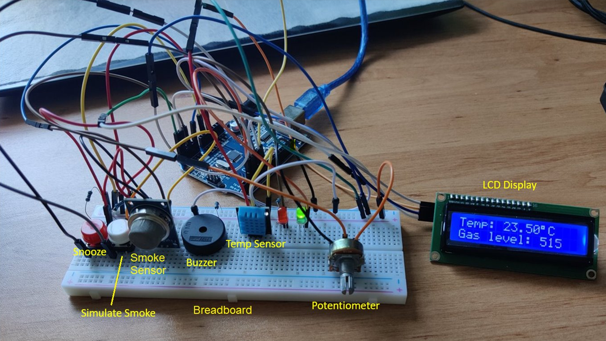
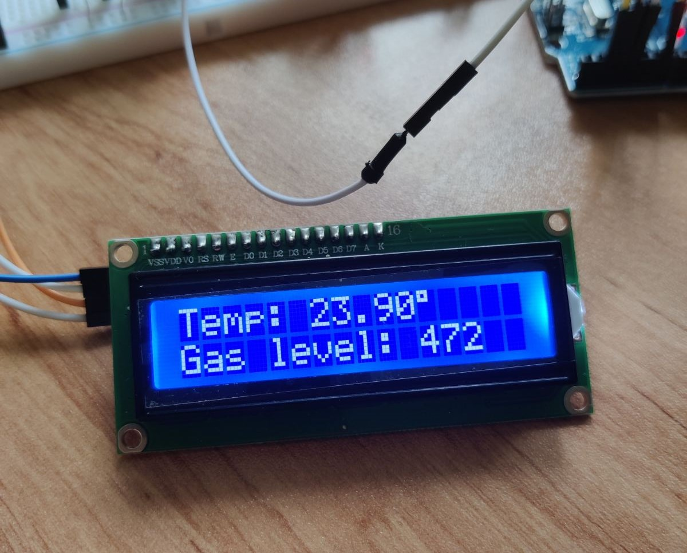
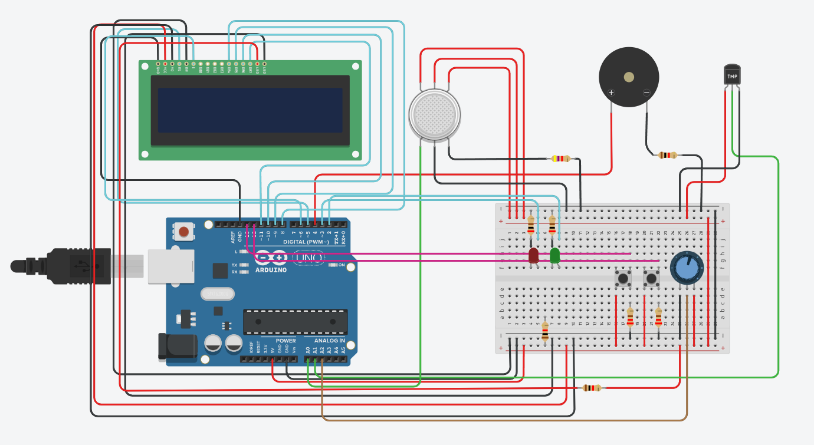
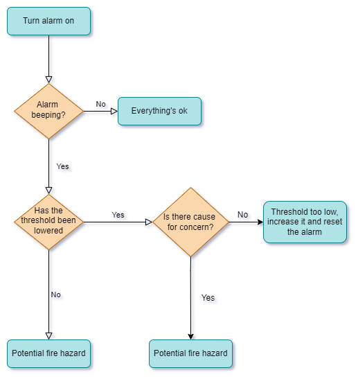

# Fire Alarm

Ардуино проект да засича и алармира при наличието на огън

## Съдържание
- [Автори](#Автори)
- [Компоненти](#Компоненти)
- [Описание](#Описание)
- [TinkerCad](#TinkerCad)
- [Схема](#Схема)

## Автори

- [Станимир Райков](https://github.com/StanimirRaykov)
- [Стелиан Грозев](https://github.com/NqkoiNqkojsi)
- [Стоян Куцаров](https://github.com/StoyanKucarov)

## Компоненти
### Arduino Uno R3

### Smoke sensor

### Tempreture sensor

### LCD Display

### Potentiometer

### Buttons

### Buzzer

### LEDs

## Описание
Проектът ни е пожарна аларма, засичаща промени в концентрацията на газове, дим и температура в контролирана среда. За основа използваме Arduino Uno, а към breadboard-a са свързани сензорите за газ и температура, LED диодите, buzzer-a, потенциометърът и бутони за симулация на пожар и рестартиране на алармата. 

Когато сензорът засече голяма концентрация на газ подава повече волтаж към ардуиното, което го изобразява като числова стойност. Забелязахме, че в различните стаи нормалната концентрация на газове варира, за това добавихме потенциометър, които променя границата на приемливи нива на газ. 

За да не трябва да симулираме опасни обстановки по време на тестване, добавихме бутон, който тества алармата, за да видим дали всичко работи нормално. Освен това имаме бутон, който я деактивира за определено време. 
На LCD дисплея постоянно се виждат нивата на температурата и газовете, за да може да се направи преценка дали границата на приемливите нива газ трябва да се променят. 

Дисплея показва новото ниво на газ при промяна чрез потенциометъра. Когато алармата се активира светва червения диод, текстът на дисплея се променя за да покаже, че има опасност и buzzer-a издава звуков сигнал. Изключва се когато газът се върне в приемливите граници или се изключи от съответния бутон.
## TinkerCad
Това е електрическата схема на проекта ни. Тя включва вече описаните компоненти. Някои от тях са малко по-различни от физическите компоненти, с които разполагахме и заради това и кода на Tinkercad симулацията е по-различен, но работещ.  

[Линк към проекта](https://www.tinkercad.com/things/73Vmj3uctmr-fire-alarm/editel?sharecode=-ZLLZeEerQ_WBVAjuvz5LY760c4C4uISC7WW1tUkoZA)
## Cхема

